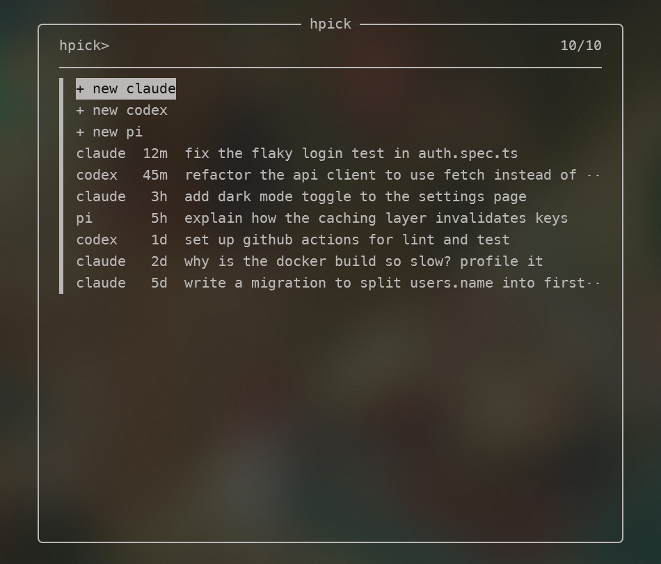

# harness-picker

`ai` — one fzf pick to start a new Claude Code, Codex or pi chat, or resume one you started in the current folder.

Made to be run from [Zed](https://zed.dev)'s terminal as a quick agent picker, but it works in any terminal.



Needs [fzf](https://github.com/junegunn/fzf) 0.42+ and whichever of `claude`, `codex`, `pi` you use.

## Install

**Windows** (PowerShell)

```powershell
winget install junegunn.fzf
iwr https://github.com/devnull03/harness-picker/releases/latest/download/ai-windows-x86_64.exe -OutFile "$HOME\.local\bin\ai.exe"
```

**Linux / WSL**

```sh
sudo apt install fzf
curl -Lo ~/.local/bin/ai https://github.com/devnull03/harness-picker/releases/latest/download/ai-linux-x86_64 && chmod +x ~/.local/bin/ai
```

**macOS** (Apple Silicon)

```sh
brew install fzf
curl -Lo ~/.local/bin/ai https://github.com/devnull03/harness-picker/releases/latest/download/ai-macos-arm64 && chmod +x ~/.local/bin/ai
```

**From source**

```sh
cargo install --git https://github.com/devnull03/harness-picker
```

Put the binary anywhere on your `PATH`; `~/.local/bin` is just a suggestion.

## Use

Run `ai` in a project folder. Type to filter, Enter to open, Esc to cancel.

Chats are read from `~/.claude/history.jsonl`, `~/.codex/history.jsonl` + `~/.codex/sessions`, and `~/.pi/agent/sessions`, and are listed only if they were started in the current folder.
